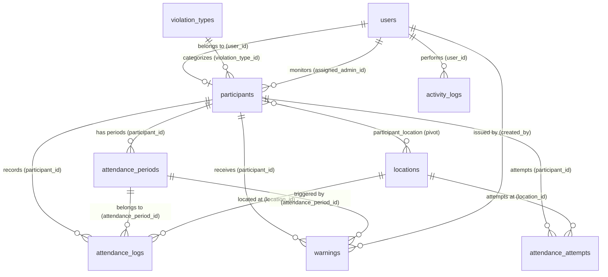
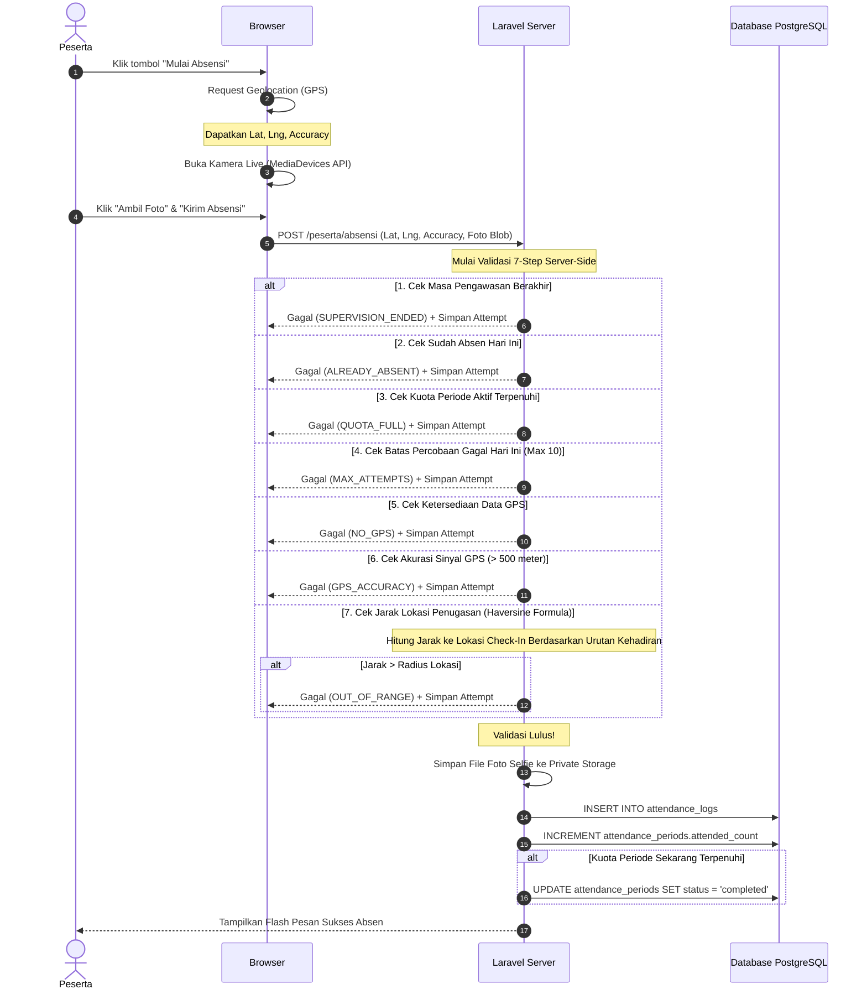

# Product Requirement Document (PRD)
## Sistem Wajib Lapor Digital (SIWALDI) — Polrestabes Semarang

---

## 1. Pendahuluan & Tujuan Proyek

Sistem Wajib Lapor Digital (**SIWALDI**) adalah sebuah aplikasi berbasis web yang dirancang khusus untuk memodernisasi dan mendigitalisasi proses absensi wajib lapor bagi para peserta pembinaan (termasuk kasus balap liar, tawuran, gangguan ketertiban umum, dan kenakalan remaja) di bawah pengawasan **Polrestabes Semarang**.

### Masalah pada Sistem Manual:
*   **Kerentanan Manipulasi:** Pencatatan manual menggunakan buku besar rawan dimanipulasi (pemalsuan tanda tangan, titip absen, atau perubahan tanggal).
*   **Inefisiensi Administrasi:** Petugas kepolisian kesulitan memantau kepatuhan kehadiran ratusan peserta secara real-time.
*   **Kurangnya Bukti Otentik:** Tidak adanya verifikasi lokasi yang akurat dan foto wajah asli (selfie) sebagai bukti kehadiran fisik pada saat melapor.
*   **Keterbatasan Escalation:** Pengawasan terhadap peserta yang tidak taat wajib lapor berjalan lambat karena peringatan tidak terdokumentasi dan terkirim secara otomatis.

### Solusi SIWALDI:
*   **GPS-Verified Attendance:** Memanfaatkan koordinat GPS browser dari perangkat peserta dan mencocokkannya dengan radius aman lokasi menggunakan formula **Haversine** di sisi server.
*   **Selfie Verification:** Peserta wajib mengambil foto selfie real-time menggunakan kamera perangkat pada saat melakukan absensi.
*   **Quota & Period System:** Sistem kuota dinamis per periode (misal: 1 kali per minggu atau 4 kali per bulan) yang dihasilkan secara otomatis oleh sistem scheduler.
*   **Automated Warning Escalation:** Peringatan berjenjang secara otomatis (Level 1, 2, 3) jika peserta gagal memenuhi target kehadiran dalam suatu periode, lengkap dengan pengiriman email notifikasi otomatis kepada admin yang ditugaskan.

---

## 2. Arsitektur & Teknologi (Tech Stack)

Aplikasi SIWALDI dibangun menggunakan arsitektur web modern yang andal, aman, dan efisien dengan teknologi berikut:

| Komponen | Teknologi | Keterangan / Kegunaan |
| :--- | :--- | :--- |
| **Bahasa Utama** | PHP 8.2+ | Bahasa backend utama. |
| **Backend Framework** | **Laravel 13** | Framework modern dengan dukungan routing, ORM Eloquent, dan modularitas tinggi. |
| **Autentikasi Admin** | **Laravel Breeze** | Autentikasi default yang aman untuk petugas kepolisian (Admin). |
| **Frontend Framework** | **Blade Template + Alpine.js** | Blade untuk rendering server-side dan Alpine.js untuk interaksi UI reaktif & dinamis di sisi klien. |
| **Styling CSS** | **Tailwind CSS v3** | Utilitas CSS modern untuk desain premium, responsif, dan dinamis. |
| **Database** | **PostgreSQL 16** | Database relasional tangguh yang dihost lokal melalui Laragon (Port 5432). |
| **Peta Interaktif** | **Leaflet.js + OpenStreetMap** | Visualisasi peta interaktif untuk manajemen koordinat lokasi wajib lapor. |
| **Verifikasi Lokasi** | **Browser Geolocation API** | Pengambilan koordinat lintang/bujur peserta secara akurat dari browser. |
| **Formula Jarak** | **Haversine Formula (Server-Side)** | Menghitung jarak melengkung bumi (meter) dari posisi peserta ke pusat lokasi wajib lapor. |
| **Sistem Pengiriman Email** | **Laravel Mail** | Mengirimkan email peringatan kepatuhan kepada petugas admin. |
| **Penyimpanan Foto** | **Laravel Private Storage Disk** | Foto selfie disimpan di folder private (`storage/app/private`), tidak dapat diakses langsung via URL publik. |

---

## 3. Fitur Utama (Core Features)

### 3.1. Dua Jalur Autentikasi (Dual-Channel Auth)
1.  **Jalur Admin (Petugas Kepolisian):**
    *   Mengakses URL `/admin/login`.
    *   Autentikasi standar menggunakan **Email dan Password** via Laravel Breeze.
    *   Terdapat peran tambahan: **Super Admin** yang memiliki hak mengelola akun admin petugas lainnya.
2.  **Jalur Peserta (Wajib Lapor):**
    *   Mengakses URL `/login`.
    *   Autentikasi ultra-praktis hanya menggunakan **NIK (Nomor Induk Kependudukan) 16 digit** tanpa memerlukan kata sandi (mengurangi kendala lupa sandi bagi peserta remaja).
    *   Dilindungi dengan **Rate Limiter** ketat (maksimal 5 kali percobaan login per IP per 10 menit) untuk mencegah serangan brute force.

### 3.2. Penugasan Lokasi Kustom per Peserta
*   Setiap peserta dapat ditugaskan ke beberapa lokasi wajib lapor yang aktif secara dinamis.
*   Admin dapat menentukan lokasi spesifik untuk urutan absensi peserta ke-1, ke-2, ke-3, dst., sesuai dengan target kuota (`quota_amount`) menggunakan tabel pivot `participant_location`.
*   Dropdown input lokasi pada form tambah/edit peserta di panel admin secara otomatis menyesuaikan jumlah barisnya dengan kuota kehadiran terpilih menggunakan bantuan Alpine.js.

### 3.3. Alur Absensi GPS + Kamera Live
*   Proses absensi dilakukan langsung menggunakan web browser tanpa perlu mengunduh aplikasi native.
*   **Tahap 1 (GPS):** Mengambil koordinat perangkat peserta (`latitude`, `longitude`, dan tingkat `accuracy` dalam meter).
*   **Tahap 2 (Kamera Live):** Menggunakan MediaDevices API untuk mengaktifkan kamera perangkat secara langsung (bukan sekadar mengupload file gambar dari galeri untuk mencegah manipulasi foto). Peserta kemudian memotret wajah mereka.
*   **Tahap 3 (Verifikasi Server):** Sistem memproses data absensi melalui **7-Step Validation** sebelum akhirnya sukses disimpan dan dicatat.

### 3.4. Manajemen Kuota & Siklus Otomatis
*   **Tipe Kuota:** Mingguan (`weekly`) atau Bulanan (`monthly`).
*   Sistem secara otomatis membuat periode kehadiran pertama (`attendance_periods`) saat peserta ditambahkan oleh admin.
*   Sistem scheduler otomatis menjalankan perintah `periods:generate-next` untuk membuat periode berikutnya setelah masa periode sebelumnya berakhir, memindahkan akumulasi status, dan memperbarui rekap kepatuhan.

### 3.5. Sistem Peringatan Kepatuhan Berjenjang (Warning System)
Setiap periode berakhir, sistem scheduler secara otomatis mengevaluasi kehadiran peserta melalui perintah `attendance:check-warnings`:
*   **Peringatan Level 1 (Kurang Hadir):** Diterbitkan jika realisasi kehadiran peserta di bawah target kuota. Menampilkan banner merah di dashboard peserta.
*   **Peringatan Level 2 (Pelanggaran Berulang):** Diterbitkan jika peserta mendapat Peringatan Level 1 berturut-turut pada periode berikutnya. Sistem otomatis mengirimkan email notifikasi kepada **Admin yang ditunjuk** sebagai pengawas peserta tersebut.
*   **Peringatan Level 3 (Pelanggaran Berat):** Diterbitkan jika kelalaian berlanjut ke periode ketiga. Sistem otomatis mengirimkan email notifikasi darurat kepada **Seluruh Admin** di kepolisian untuk tindakan hukum/penjemputan fisik lebih lanjut.

### 3.6. Override Manual & Riwayat Detail
*   Jika peserta mengalami kendala teknis darurat (misal: GPS perangkat mati total), Admin memiliki otoritas penuh untuk mencatatkan kehadiran secara manual (override) melalui tombol khusus di panel Admin.
*   Tindakan override ini mencatat status khusus (`manual_override`) beserta alasan manual dari petugas admin untuk keperluan audit.

---

## 4. Halaman & Antarmuka Pengguna (System Pages)

### 4.1. Sisi Peserta (Participant Interface)
1.  **Halaman Login (`/login`):**
    *   Form sederhana untuk memasukkan 16-digit NIK.
    *   Rate limiting feedback jika terlalu banyak percobaan salah.
2.  **Dashboard Peserta (`/peserta/dashboard`):**
    *   Status Pengawasan: Menampilkan tanggal mulai dan tanggal berakhir pengawasan.
    *   Informasi Kuota: Progress bar real-time kehadiran periode aktif (misal: `1/2 Kehadiran Terpenuhi`).
    *   Banner Peringatan: Muncul secara mencolok jika peserta memiliki status Peringatan aktif (Level 1, 2, atau 3).
    *   Peta Penugasan: Menampilkan lokasi-lokasi wajib lapor yang ditugaskan kepada peserta beserta penanda radius aman melapor.
3.  **Halaman Absensi (`/peserta/absensi`):**
    *   Panel interaktif dengan indikator langkah-langkah absensi.
    *   Pemicu deteksi lokasi GPS reaktif (Idle $\rightarrow$ Loading $\rightarrow$ Sukses/Error).
    *   Jendela pemotretan kamera live dengan preview waktu nyata.
    *   Ringkasan konfirmasi sebelum pengiriman data ke server.
4.  **Riwayat Absensi (`/peserta/riwayat`):**
    *   Daftar seluruh riwayat kehadiran yang berhasil dicatatkan, diurutkan dari yang terbaru.
    *   Menampilkan tanggal, jam, koordinat, lokasi wajib lapor, dan foto selfie terkait.

### 4.2. Sisi Panel Admin (Admin Dashboard & Control Panel)
1.  **Halaman Login Admin (`/admin/login`):**
    *   Form input email dan password yang dikelola oleh Laravel Breeze.
2.  **Dashboard Admin (`/admin/dashboard`):**
    *   Statistik Utama (Widget Card): Total peserta aktif, total lokasi aktif, jumlah peringatan aktif, dan persentase tingkat kepatuhan keseluruhan.
    *   Tabel Ringkasan: Kehadiran hari ini, peserta yang baru ditambahkan, dan peringatan level tinggi terbaru.
3.  **Manajemen Peserta (`/admin/participants`):**
    *   Daftar Peserta dengan pagination (10 data per halaman).
    *   Form Tambah/Edit Peserta: Input biodata lengkap, NIK, jenis pelanggaran, durasi masa pengawasan, pilihan tipe kuota (mingguan/bulanan), nominal kuota kehadiran, pilihan admin pengawas, serta alokasi lokasi wajib lapor yang disesuaikan secara dinamis.
    *   Aksi Deaktivasi (Soft-deactivate) atau Penghapusan Permanen (Force Delete).
4.  **Manajemen Lokasi (`/admin/locations`):**
    *   Daftar Lokasi Wajib Lapor Kepolisian dengan koordinat latitude & longitude.
    *   Form Tambah/Edit Lokasi: Terintegrasi dengan peta interaktif **Leaflet.js** untuk meletakkan pin lokasi secara visual, otomatis mengisi kolom latitude dan longitude, serta menentukan batas radius aman melapor (dalam meter).
    *   Aksi Toggle Aktif/Nonaktif Lokasi secara aman (tanpa menghapus data histori).
5.  **Manajemen Jenis Pelanggaran (`/admin/violation-types`):**
    *   CRUD sederhana untuk mengelola daftar pelanggaran (balap liar, tawuran, dll.) guna pengelompokan statistik peserta.
6.  **Laporan Kepatuhan (`/admin/reports`):**
    *   Laporan rekapitulasi kepatuhan kehadiran mingguan/bulanan seluruh peserta secara komprehensif.
    *   Halaman Detail Kepatuhan Peserta (`/admin/reports/{participant}`): Menampilkan timeline absensi lengkap, riwayat percobaan gagal (`attendance_attempts`), dan riwayat penerbitan surat peringatan (`warnings`).
7.  **Manajemen Akun Admin (`/admin/accounts`):**
    *   *Khusus Super Admin:* CRUD untuk mendaftarkan akun petugas kepolisian baru atau menonaktifkan akun admin lainnya.

---

## 5. Skema & Relasi Database (Database Schema & Relations)

Aplikasi SIWALDI menggunakan database PostgreSQL dengan 10 tabel utama yang saling berelasi erat:

### 5.1. Detail Struktur Tabel Database

#### 1. Tabel `users`
Menyimpan kredensial autentikasi utama baik untuk Admin (Petugas) maupun Peserta (yang dibuatkan akun user secara paralel).
*   `id` (BigInt, PK, Auto-Increment)
*   `name` (String, 255)
*   `email` (String, 255, Unique, Nullable untuk peserta)
*   `password` (String, 255, Nullable untuk peserta)
*   `role` (String, 10, Default: `'peserta'`) - Pilihan: `'admin'`, `'super_admin'`, `'peserta'`
*   `nik` (Char, 16, Unique, Nullable untuk admin) - NIK 16 digit peserta untuk autentikasi login
*   `is_active` (Boolean, Default: `true`)
*   `remember_token` (String, 100, Nullable)
*   `timestamps()` (created_at, updated_at)

#### 2. Tabel `violation_types`
Menyimpan master jenis kenakalan remaja / pelanggaran ketertiban umum.
*   `id` (BigInt, PK, Auto-Increment)
*   `name` (String, 255, Unique) - Contoh: `'Balap Liar'`, `'Tawuran'`, `'Miras'`
*   `description` (Text, Nullable)
*   `timestamps()`

#### 3. Tabel `participants`
Menyimpan profil detail peserta pembinaan yang menjalani wajib lapor.
*   `id` (BigInt, PK, Auto-Increment)
*   `user_id` (BigInt, FK $\rightarrow$ `users.id`, Cascade on Delete)
*   `assigned_admin_id` (BigInt, FK $\rightarrow$ `users.id`, Nullable, Restrict on Delete) - Admin pengawas yang bertanggung jawab
*   `full_name` (String, 255)
*   `nik` (Char, 16, Index)
*   `address` (Text, Nullable)
*   `phone` (String, 20, Nullable)
*   `violation_type_id` (BigInt, FK $\rightarrow$ `violation_types.id`, Restrict on Delete)
*   `case_notes` (Text, Nullable)
*   `supervision_start` (Date) - Awal masa wajib lapor
*   `supervision_end` (Date) - Akhir masa wajib lapor
*   `quota_type` (String, 10) - Pilihan: `'weekly'`, `'monthly'`
*   `quota_amount` (Integer) - Jumlah kewajiban absen dalam satu periode (contoh: 2 kali)
*   `status` (String, 20, Default: `'active'`) - Pilihan: `'active'`, `'completed'`, `'deactivated'`
*   `timestamps()`

#### 4. Tabel `locations`
Menyimpan daftar titik koordinat pos/kantor polisi tempat peserta diizinkan melapor.
*   `id` (BigInt, PK, Auto-Increment)
*   `name` (String, 255) - Contoh: `'Polrestabes Semarang'`, `'Polsek Gajahmungkur'`
*   `address` (Text, Nullable)
*   `latitude` (Decimal, 10,7)
*   `longitude` (Decimal, 10,7)
*   `radius_meters` (Integer, Default: `100`) - Batas toleransi GPS dalam meter
*   `is_active` (Boolean, Default: `true`)
*   `created_by` (BigInt, FK $\rightarrow$ `users.id`, Nullable)
*   `timestamps()`
*   *Index:* `['latitude', 'longitude']` untuk efisiensi query spasial

#### 5. Tabel `participant_location` (Tabel Pivot)
Tabel relasi many-to-many dinamis untuk menetapkan lokasi wajib lapor unik yang terikat pada urutan check-in peserta.
*   `id` (BigInt, PK, Auto-Increment)
*   `participant_id` (BigInt, FK $\rightarrow$ `participants.id`, Cascade on Delete)
*   `location_id` (BigInt, FK $\rightarrow$ `locations.id`, Cascade on Delete)
*   `check_in_order` (UnsignedSmallInteger) - Urutan kehadiran (ke-1, ke-2, ke-3, dst) dalam periode aktif
*   `timestamps()`
*   *Unique Constraint:* `['participant_id', 'check_in_order']` (Mencegah satu nomor urutan absen ditugaskan ke beberapa lokasi berbeda sekaligus)

#### 6. Tabel `attendance_periods`
Melacak kuota kehadiran berkala peserta berdasarkan rentang waktu dinamis.
*   `id` (BigInt, PK, Auto-Increment)
*   `participant_id` (BigInt, FK $\rightarrow$ `participants.id`, Cascade on Delete)
*   `period_type` (String, 10) - Pilihan: `'weekly'`, `'monthly'`
*   `period_start` (Date)
*   `period_end` (Date)
*   `target_count` (Integer) - Total kuota kehadiran wajib (diambil dari `participants.quota_amount`)
*   `attended_count` (Integer, Default: `0`) - Counter denormalisasi absensi sukses
*   `status` (String, 20, Default: `'active'`) - Pilihan: `'active'`, `'completed'`
*   `timestamps()`
*   *Unique Constraint:* `['participant_id', 'period_start', 'period_end']` (Mencegah tumpang tindih periode peserta yang sama)

#### 7. Tabel `attendance_logs`
Menyimpan riwayat absensi sukses peserta yang memenuhi seluruh validasi.
*   `id` (BigInt, PK, Auto-Increment)
*   `participant_id` (BigInt, FK $\rightarrow$ `participants.id`, Cascade on Delete)
*   `attendance_period_id` (BigInt, FK $\rightarrow$ `attendance_periods.id`, Nullable, Cascade on Delete)
*   `location_id` (BigInt, FK $\rightarrow$ `locations.id`, Nullable, Restrict)
*   `attendance_date` (Date)
*   `attendance_time` (Time)
*   `latitude` (Decimal, 10,7)
*   `longitude` (Decimal, 10,7)
*   `distance_meters` (Decimal, 8,2) - Jarak aktual dari peserta ke titik lokasi (dalam meter)
*   `photo_path` (String, 500) - Path file foto selfie di private storage
*   `notes` (Text, Nullable)
*   `status` (String, 20, Default: `'valid'`) - Pilihan: `'valid'`, `'manual_override'`
*   `timestamps()`
*   *Unique Constraint:* `['participant_id', 'attendance_date']` (Membatasi absensi maksimal satu kali sehari)
*   *Index:* `attendance_date`

#### 8. Tabel `attendance_attempts`
Mencatat seluruh log percobaan absen peserta yang mengalami kegagalan validasi sistem. Berguna untuk mendeteksi indikasi spoofing lokasi atau pembuktian kendala teknis.
*   `id` (BigInt, PK, Auto-Increment)
*   `participant_id` (BigInt, FK $\rightarrow$ `participants.id`, Nullable, Cascade on Delete)
*   `location_id` (BigInt, FK $\rightarrow$ `locations.id`, Nullable, Set Null)
*   `attempted_at` (Timestamp)
*   `latitude` (Decimal, 10,7, Nullable)
*   `longitude` (Decimal, 10,7, Nullable)
*   `distance_meters` (Decimal, 8,2, Nullable)
*   `failure_reason` (String, 255) - Alasan penolakan (misal: `'OUT_OF_RANGE'`, `'GPS_ACCURACY'`, `'NO_GPS'`)
*   `metadata` (JSONB, Nullable) - Menyimpan info tambahan seperti tingkat akurasi GPS dalam meter
*   `ip_address` (String, 45, Nullable)
*   `user_agent` (Text, Nullable)
*   `timestamps()`
*   *Indexes:* `participant_id`, `attempted_at`

#### 9. Tabel `warnings`
Menyimpan catatan riwayat penerbitan surat peringatan otomatis berjenjang kepatuhan peserta.
*   `id` (BigInt, PK, Auto-Increment)
*   `participant_id` (BigInt, FK $\rightarrow$ `participants.id`, Cascade on Delete)
*   `attendance_period_id` (BigInt, FK $\rightarrow$ `attendance_periods.id`, Nullable, Set Null)
*   `level` (String, 10) - Pilihan: `'level_1'`, `'level_2'`, `'level_3'`
*   `reason` (Text)
*   `issued_at` (Timestamp)
*   `status` (String, 20, Default: `'active'`) - Pilihan: `'active'`, `'resolved'`
*   `resolved_at` (Timestamp, Nullable)
*   `notes` (Text, Nullable)
*   `created_by` (BigInt, FK $\rightarrow$ `users.id`, Nullable) - Admin yang memproses resolusi
*   `timestamps()`

#### 10. Tabel `activity_logs`
Mencatat log audit jejak aktivitas penting seluruh admin untuk alasan transparansi dan integritas data.
*   `id` (BigInt, PK, Auto-Increment)
*   `user_id` (BigInt, FK $\rightarrow$ `users.id`, Nullable, Set Null)
*   `action` (String, 100) - Contoh: `'create_participant'`, `'toggle_location'`, `'override_attendance'`
*   `target_type` (String, 100, Nullable) - Contoh: `'participant'`, `'location'`
*   `target_id` (BigInt, Nullable) - ID dari entitas target
*   `description` (Text, Nullable) - Detail teks log aktivitas
*   `metadata` (JSONB, Nullable)
*   `ip_address` (String, 45, Nullable)
*   `timestamps()`
*   *Indexes:* `user_id`, `action`, `['target_type', 'target_id']`

---

## 6. Mekanisme Kunci & Alur Absensi GPS

Proses absensi pada SIWALDI menerapkan validasi sisi server (backend) yang sangat ketat untuk meminimalisasi kecurangan pemalsuan lokasi (*fake GPS*).

### Formula Spasial Haversine (Sisi Server)
Perhitungan jarak melengkung bumi menggunakan formula Haversine yang diimplementasikan di backend PHP:

$$\Delta\text{lat} = \text{lat}_2 - \text{lat}_1$$
$$\Delta\text{lng} = \text{lng}_2 - \text{lng}_1$$
$$a = \sin^2\left(\frac{\Delta\text{lat}}{2}\right) + \cos(\text{lat}_1) \cdot \cos(\text{lat}_2) \cdot \sin^2\left(\frac{\Delta\text{lng}}{2}\right)$$
$$c = 2 \cdot \arctan2\left(\sqrt{a}, \sqrt{1-a}\right)$$
$$d = R \cdot c$$

*Dimana:*
*   $R$ adalah jari-jari bumi (rata-rata $6.371.000$ meter).
*   $d$ adalah jarak akhir dalam meter.
*   Jika $d \le \text{radius\_meters}$ lokasi, absensi dinyatakan valid secara spasial.

---

## 7. Keamanan, Batasan & Kepatuhan

Untuk menjamin integritas data pengawasan kepolisian, sistem SIWALDI menerapkan beberapa lapis keamanan teknis:

1.  **Proteksi Private Disk Storage:**
    *   Seluruh foto selfie hasil absensi disimpan pada direktori aman (`private` disk) di server.
    *   Foto tidak diekspos secara publik. Akses untuk melihat foto wajib melalui route khusus `/admin/attendance/{log}/photo` yang dilindungi middleware `auth` dan peran `admin`.
2.  **Rate Limiting Absensi & Login:**
    *   Login NIK peserta dilindungi rate limit: maksimal 5 kali percobaan per IP dalam rentang waktu 10 menit untuk menghindari brute-force NIK secara beruntun.
    *   Pengiriman absensi sukses dibatasi menggunakan middleware `throttle:absensi` maksimal 10 kali pengiriman per hari per akun peserta demi mencegah spamming request.
3.  **Session Timeout:**
    *   Durasi session login tidak aktif diatur secara ketat maksimal 30 menit (`SESSION_LIFETIME=30`). Petugas admin atau peserta akan otomatis keluar (logout) jika tidak ada aktivitas.
4.  **Log Audit Aktivitas Petugas:**
    *   Terdapat `LogActivityMiddleware` (`log.activity`) pada seluruh rute admin untuk mendokumentasikan setiap aksi penambahan peserta, pembaruan lokasi, penghapusan, dan tindakan manual override.
